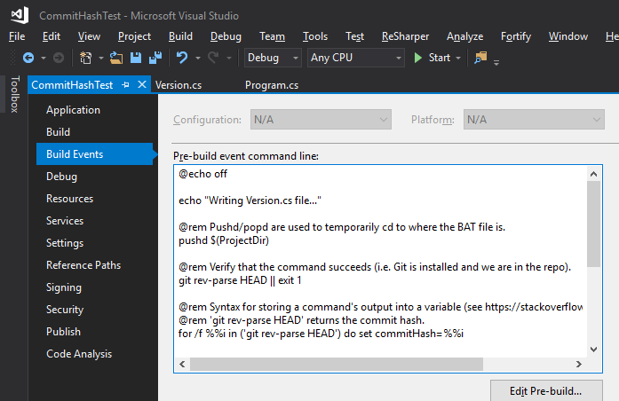

This is a proof-of-concept console program that just prints out its current commit hash.

To test it, run it and take note of the commit hash, then make some minor change (e.g. add a comment), commit your changes and rerun it - the commit hash will have changed.

The program works by writing a Version.cs file each time you build. This file has the correct current hash. The file Version.cs is written by a Batch script that is within the Pre-build step of Visual Studio.

# Screenshot

Here is a screenshot of the Pre-build step:

# Pre-build code

The is the code of the pre-build.

    @echo off

    echo "Writing Version.cs file..."

    @rem Pushd/popd are used to temporarily cd to where the BAT file is.
    pushd $(ProjectDir)

    @rem Verify that the command succeeds (i.e. Git is installed and we are in the repo).
    git rev-parse HEAD || exit 1

    @rem Syntax for storing a command's output into a variable (see https://stackoverflow.com/a/2340018/492336).
    @rem 'git rev-parse HEAD' returns the commit hash.
    for /f %%i in ('git rev-parse HEAD') do set commitHash=%%i

    @rem Syntax for printing multiline text to a file (see https://stackoverflow.com/a/23530712/492336).
    (
    echo namespace GitCommitHashPrinter
    echo {
    echo     class Version
    echo     {
    echo         public static string CommitHash { get; set; } = "%commitHash%";
    echo     }
    echo }
    )>"Version.cs"

    popd    
